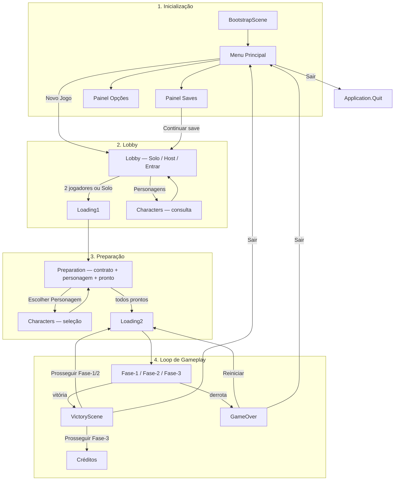

# Diagrama — Fluxo de Telas

Baseado em [screen-flow.md](./screen-flow.md) e [screen-flow.md (requisitos)](../screen-flow.md).

## Diagrama principal

## Componentes

| Papel | Script |
|-------|--------|
| Máquina de estados | `ScreenFlowStateMachine` + `GameSessionContext` |
| Troca de cena | `ScreenFlowController` + `SceneFlowCatalog` |
| Menu | `MainMenuController` |
| Lobby | `LobbyFlowController` + `LobbySessionManager` |
| Preparação | `PreparationScreenController` + `PreparationSessionManager` |
| Personagens | `CharactersScreenController` + `CharactersSessionManager` |
| Loading | `LoadingScreenController` |
| Fim de partida | `EndGameScreenController` |
| Contrato | `Contract_1.asset` → `Fase-1` |
